# Spike — `trustless_work_dart` + `trustless_work_flutter_storage`

**Fecha**: 2026-04-15
**Autor**: Andrés Peña (HabitaNexus / Dojo Coding)
**Estado**: Brainstorming completo — pendiente aprobación para escribir spec formal e iniciar implementación
**Tiempo invertido en brainstorming**: ~1 sesión

---

## Contexto

HabitaNexus es un marketplace de alquiler long-term en Costa Rica construido en Flutter. El escrow digital (depósito de garantía protegido) es central a su propuesta de valor — evita estafas, supera el límite de SINPE Móvil (¢100k/día) y habilita custodia no-bancaria. La startup está clasificada **🔴 URGENTE** en el análisis de estructura corporativa (`~/Escritorio/lapc506-personal-dogfood/structure-decision.md`): no puede operar con dinero de terceros sin entity legal formal + SDK técnico funcional.

El SDK de Trustless Work existe solo en React/TypeScript (`@trustless-work/escrow`). No hay equivalente Dart/Flutter. Sin él, no hay forma limpia de integrar escrows desde HabitaNexus.

**Este plan es para el spike que porta el SDK a Dart**, vive inicialmente dentro del monorepo, y eventualmente se extrae como paquete OSS mantenido conjuntamente con Trustless Work.

---

## Decisiones tomadas durante el brainstorming

| Pregunta | Decisión | Razonamiento |
|---|---|---|
| Alcance del spike | **Opción B** — esqueleto en `packages/`, sin publicar a pub.dev | Time-flexible; validar arquitectura antes de commitment |
| Capa de integración | **Opción A** — cliente HTTP 1:1 del API gateway de TW | No reimplementar Soroban; reusar la abstracción ya auditada de TW |
| Ownership del repo | **`packages/` primero → `github.com/DojoCodingLabs/trustless-work-dart` después → pub.dev bajo Trustless Work verified publisher** | Itera local, extrae cuando madura, publica bajo la identidad correcta |
| Naming del paquete core | **`trustless_work_dart`** | Sufijo `_dart` explícito desambigua para devs que lo importan sin contexto |
| Naming del hermano | **`trustless_work_flutter_storage`** | Wallet embebida con `flutter_secure_storage`, dependencias Flutter aisladas |
| Arquitectura del signer | **Approach C** — `TransactionSigner` interface + `KeyPairSigner` + `CallbackSigner` en el core Dart puro; `SecureStorageKeyPairSigner` en el hermano | Core queda reusable desde Jaspr, Flutter Web, Dart server, CLI |
| Alcance funcional v0.1 | `initializeEscrow` (single-release) + `fundEscrow` + `getEscrow` + `releaseFunds` + `sendTransaction` helper + integración testnet real | Cubre el ciclo completo del caso de uso de HabitaNexus; single-release es el más simple |
| Generación de tipos | **Opción A** — hand-written con `freezed` + `json_serializable` | TW no publica OpenAPI bundle unificado; los fragments por endpoint no son viables para codegen |
| Licencia | **MIT** | Matcheo con lo que declara el SDK React en su README; matchea convención pub.dev |
| Reactividad | **Opción 3** — `Future<T>` puro + `Stream<EscrowEvent>` marcado `@experimental` basado en polling simple de `getEscrow` con diff de estado | HabitaNexus es urgente; shape del API público puede mantenerse estable al reemplazar implementación en v0.2 |
| Estructura legal HabitaNexus | **Delaware LLC (primaria) + CR SRL (OpCo)** = Delaware Tostada | La LLC es la identidad jurídica; la SRL es solo para facturación electrónica CR y empleados CR — NO para custodia (eso lo hace el smart contract on-chain) |

---

## Flujo end-to-end del ciclo de vida del contrato de alquiler

**Restricción regulatoria clave**: HabitaNexus NO toca fondos en colones en ningún momento. Sin licencia SUGEF, ser intermediario de fondos fiat = operador financiero no autorizado. Por eso el flujo se divide en dos carriles separados, y HabitaNexus es siempre **plataforma de coordinación**, nunca payee ni custodio.

| Flujo | Monto | Medio | ¿Custodia/procesa? | ¿HabitaNexus toca fondos? |
|---|---|---|---|---|
| **Depósito de garantía** | Una vez | USDC on-chain | Smart contract Soroban (Trustless Work) | No (el contrato custodia, no una persona) |
| **Pagos mensuales de alquiler** | Recurrente | SINPE colones | **Kindo** (procesador regulado CR) | No (flujo directo inquilino → propietario) |

### Pre-contrato (sin dinero)
1. **Onboarding invisible**: HabitaNexus app genera KeyPair Stellar, lo guarda en `flutter_secure_storage` vía `trustless_work_flutter_storage`. El usuario (José, 65 años) nunca ve wallet, seed phrase ni private key.
2. **Negociación**: propietario ↔ inquilino acuerdan términos (alquiler, depósito, duración, condiciones). HabitaNexus arma expediente digital.

### Firma + Depósito de garantía (escrow único)
3. **⚠ On-ramp colones → USDC**: inquilino paga vía **Onramper WebView embebido** (u otro provider — spike separado). Convierte colones a USDC en la wallet Stellar del inquilino. HabitaNexus NO toca colones — el provider absorbe compliance PCI/KYC.
4. **`initializeEscrow`**: TW devuelve unsigned XDR. Signer (HabitaNexus como platform o inquilino) firma. `/helper/send-transaction` despliega el contrato en Soroban.
5. **`fundEscrow`**: TW devuelve unsigned XDR. Signer (inquilino) firma transferencia USDC. USDC queda retenido on-chain en el contrato escrow hasta fin del contrato.

### Durante el alquiler (mensual, FUERA del escrow)
6. **Pagos mensuales vía Kindo**: inquilino → propietario DIRECTO por SINPE. Kindo procesa, HabitaNexus recibe webhook con confirmación, actualiza expediente digital con el recibo. El escrow del depósito queda intacto; solo los pagos mensuales fluyen. HabitaNexus monitorea el estado del escrow via `Stream<EscrowEvent>` (polling v0.1).

### Fin del contrato
7a. **Happy path**: SDK Dart `releaseFunds` → USDC: contrato Soroban → wallet inquilino → opcionalmente off-ramp inverso a colones via mismo provider WebView.
7b. **Sad path (disputa, v0.2)**: `startDispute` → resolver decide → `resolveDispute`.

---

## Arquitectura del paquete

### Core — `packages/trustless_work_dart/`

**Dart puro**. Sin dependencias Flutter.

```
lib/
├── src/
│   ├── client/
│   │   ├── trustless_work_client.dart      # API pública principal
│   │   ├── trustless_work_config.dart       # baseUrl, apiKey, network
│   │   └── http_client.dart                 # wrapper sobre `dio` o `http`
│   ├── signer/
│   │   ├── transaction_signer.dart          # interface
│   │   ├── keypair_signer.dart              # wallet embebida con stellar_flutter_sdk
│   │   └── callback_signer.dart             # adapter genérico
│   ├── endpoints/
│   │   ├── deployer.dart                    # /deployer/single-release
│   │   ├── single_release_operations.dart   # fund, release
│   │   ├── helpers.dart                     # /helper/send-transaction
│   │   └── queries.dart                     # getEscrow
│   ├── models/
│   │   ├── escrow.dart                      # freezed, json_serializable
│   │   ├── milestone.dart
│   │   ├── role.dart
│   │   ├── trustline.dart
│   │   ├── flags.dart
│   │   └── payloads/                        # request types
│   ├── events/
│   │   ├── escrow_event.dart                # sealed class, 7 variantes
│   │   └── polling_event_stream.dart        # @experimental, polling-based
│   └── errors/
│       ├── trustless_work_error.dart        # sealed class
│       └── result.dart                      # Result<T, E> idiomático
├── trustless_work_dart.dart                  # barrel export
pubspec.yaml                                   # SDK constraint, deps: dio/http, freezed, json_annotation, stellar_flutter_sdk
README.md                                      # incluye "Qué ES y qué NO ES el paquete"
CHANGELOG.md
LICENSE                                        # MIT
```

### Hermano — `packages/trustless_work_flutter_storage/`

Depende de `trustless_work_dart` + `flutter_secure_storage`.

```
lib/
├── src/
│   └── secure_storage_keypair_signer.dart   # wallet embebida persistente
├── trustless_work_flutter_storage.dart       # barrel export
pubspec.yaml
README.md
LICENSE                                        # MIT
```

---

## Dependencias bilaterales con Trustless Work

1. **Confirmar licencia MIT + formalizar `LICENSE` file en `Trustless-Work/react-library-trustless-work`** (pedido a Alberto Chaves por WhatsApp 2026-04-15).
2. **Bundle OpenAPI unificado vía `@nestjs/swagger` `/api-json`** (pedido, nice-to-have, habilitará migración a codegen en v0.2+).
3. **Verified publisher en pub.dev bajo `Trustless Work`** cuando el paquete madure. Requiere call de alineación.
4. **Cómo TW maneja fee sponsorship** — preguntar a Alberto: ¿TW absorbe XLM fees? ¿Usa `FeeBumpTransaction`? ¿Espera que la plataforma (HabitaNexus) sponsoree? Esto define si el SDK Dart v0.2 debe incluir fee-bump support.

---

## Dependencias externas (NO las resuelve el SDK Dart — documentadas para evitar confusión)

### Fee sponsorship (analogía Starknet AA + Paymaster)

La analogía con Starknet (AA nativo + AVNU Paymaster) **es válida pero parcial**. Misma meta de UX web2 sobre blockchain, pero Soroban tiene primitivos menos elegantes:

| Capacidad | Starknet | Stellar/Soroban |
|---|---|---|
| AA nativo (cada cuenta = contrato) | Sí | No (cuentas classic son Ed25519; Soroban custom accounts en progreso) |
| Paymaster token-agnostic | Sí (AVNU) | Parcial (`FeeBumpTransaction` solo en XLM) |
| Sponsored reserves | N/A | Sí (protocol-level) |

**Implicación para HabitaNexus**: la combinación `KeyPairSigner` embebido + USDC + fee sponsor externo ≈ AA pragmático. Fees en Stellar son ~$0.0000012/op, baratos de absorber. El SDK Dart v0.1 NO incluye fee-bump support; v0.2+ potencialmente sí (depende de cómo TW ya lo maneje).

### Kindo (Prosoft CR) — procesa los pagos mensuales, FUERA del escrow

Kindo es SaaS B2B para **instituciones financieras CR** (22 años, 60 clientes nacionales, 22M transacciones/mes). Integra con SINPE para automatizar cobros/pagos/transferencias.

**Rol en HabitaNexus**: **procesador de los pagos mensuales de alquiler** (inquilino → propietario, SINPE colones, DIRECTO sin pasar por HabitaNexus como intermediario). HabitaNexus solo recibe webhooks de confirmación para actualizar el expediente digital. No toca los fondos.

**Restricción regulatoria**: HabitaNexus no tiene licencia SUGEF; no puede ser intermediario de fondos fiat. Kindo sí es entidad regulada, por eso es el procesador.

**Integración**: B2B bajo contrato con Prosoft. API REST probablemente con HMAC/JWT mutual TLS. Integración vive en **backend de HabitaNexus** (no cliente Flutter directo, por seguridad de API keys). **NO se extrae como paquete Dart OSS** — es integración enterprise específica, sin comunidad que la reuse.

**Implicación arquitectónica**: HabitaNexus requiere un backend propio aunque sea mínimo. El `trustless_work_dart` debe ser Dart puro (reusable en Flutter mobile + Dart server) para que el mismo SDK sirva para monitorear escrows desde el backend que recibe webhooks de Kindo.

### On-ramp fiat → USDC (Stellar) — WebView embebido, NO librería Dart adicional

El SDK Dart NO resuelve conversión colones → USDC. Esto es spike separado con timeline paralelo.

**Patrón de integración**: **WebView embebido** (`flutter_inappwebview` o `webview_flutter`), NO librería Dart del on-ramp. Razones:

1. El checkout, KYC, y payment method selection son UX crítica hosteada por el on-ramp. Replicarla en Dart no agrega valor.
2. El regulatory blast radius lo absorbe el provider (fraud, AML, PCI-DSS no son responsabilidad de HabitaNexus).
3. Es el patrón estándar de fintech (Stripe Checkout, Plaid Link, Stripe Identity funcionan igual).
4. Un wrapper Dart sería 50-100 líneas — no justifica paquete pub.dev.

**Candidatos a evaluar en spike separado**:

| Provider | Estado | Notas |
|---|---|---|
| **Onramper (aggregator)** | Principal candidato | 13 on-ramps en CR, 11 payment methods. ⚠ SINPE Móvil NO listado. ⚠ USDC-Stellar no confirmado en listing genérico — validar via API (`/supported/onramps`, `/supported/payment-types` con `country=CR` + `destination=USDC_XLM`). Doble comisión |
| **Bitso Payouts & Funding** | Limitado | "USDC Multi-Network Support" mencionado (Stellar probablemente incluido, confirmar via `/networks`). **CR NO está en su cobertura KYC** (solo MX/BR/CO/AR). Solo servible como B2B desde entidad en país soportado — desproporcionado para MVP |
| **Lemon** (ARG) | **Descartado** | Sin documentación API pública |
| **Bitpoint CR** | **Descartado** | Ya murió |

**Recomendación**: el spike del SDK Dart NO se bloquea en esto. v0.1 usa Stellar testnet + XLM testnet, sin USDC real, sin on-ramp. Producción requiere completar el spike de on-ramp antes de lanzar.

### Regla de decisión para extraer como paquete Dart OSS

No todas las integraciones se convierten en paquete publicado. Criterios para justificar extracción:
- (a) Hay valor para comunidad más amplia (multi-consumer).
- (b) Existe contraparte que quiere co-mantener.
- (c) La API es estable.

| Integración | ¿Paquete OSS Dart? | Patrón |
|---|---|---|
| Trustless Work | **Sí** (`trustless_work_dart`) | SDK REST client, MIT, pub.dev bajo TW verified publisher |
| Onramper / on-ramp provider | **No** | WebView embebido |
| Kindo | **No** | Integración enterprise B2B, HTTP inline en backend HabitaNexus |

---

## Roadmap post-v0.1

**v0.2**:
- Reemplazar `PollingEventStream` por implementación híbrida: Horizon SSE para effects classic + Soroban `getEvents` con cursor para contract events. API público (`Stream<EscrowEvent>`) no rompe.
- Agregar `updateEscrow`, milestones (`changeMilestoneStatus`, `approveMilestone`).
- Agregar disputas (`startDispute`, `resolveDispute`).

**v0.3**:
- Multi-release escrows.
- Indexer queries (`getEscrowsFromIndexerByRole`, `getEscrowsFromIndexerBySigner`).
- Multiple balance queries (`getMultipleEscrowBalances`).

**v0.4+**:
- Migrar tipos a codegen desde OpenAPI bundle (si TW publica).
- Paquetes opcionales: `trustless_work_riverpod`, `trustless_work_bloc`.

---

## Archivos a crear

### Dentro del monorepo HabitaNexus (`/home/kvttvrsis/Documentos/GitHub/habitanexus/`)

**Contexto del monorepo**: HabitaNexus sigue el patrón establecido por los repos hermanos `github.com/DojoCodingLabs/altrupets/monorepo/` y `github.com/DojoCodingLabs/flutter-agentic-boilerplate/`:

```
apps/
├── backend/         # NestJS (TypeScript) — procesa webhooks Kindo, API keys privadas,
│                    # integración con SDK React @trustless-work/escrow
├── mobile/          # Flutter — consume trustless_work_dart + trustless_work_flutter_storage
└── widgetbook/      # Flutter widget showcase
docs/                # SOPs, user_expectations, ux-research, referencias legales
infrastructure/      # Terraform, ArgoCD, Harbor (ya existente)
k8s/                 # Manifests (ya existente)
packages/            # Paquetes Dart/Flutter publicables (actualmente vacío)
```

**Implicación del split frontend/backend**:

- **Backend NestJS** importa `@trustless-work/escrow` (SDK React/TypeScript existente de TW) — útil para operaciones server-side: webhook processors, coordinación de disputas, análisis.
- **Mobile Flutter** importa `trustless_work_dart` + `trustless_work_flutter_storage` (lo que construimos aquí) — para flujos user-facing donde el inquilino/propietario firma con su KeyPair embebido.
- Ambos SDKs hablan al mismo gateway (`api.trustlesswork.com`), ven los mismos escrows. Consistencia de datos garantizada por el backend de TW.

### Archivos a crear

1. **Spec formal** (tras ExitPlanMode): `docs/superpowers/specs/2026-04-15-trustless-work-dart-spike-design.md`
   - Expandir las decisiones del brainstorming
   - Incluir flujo end-to-end con ASCII + Mermaid diagrams
   - Documentar dependencias bilaterales con TW
   - Secciones: contexto, alcance, arquitectura, módulos, data flow, error handling, testing, CI, gobernanza, roadmap

2. **SOP de negocio**: `docs/sop-escrow-deposito-garantia.md` (consistente con naming de `sop-flujo-arrendamiento.md`, `sop-adiciones-internacionalizacion.md`, `sop-referidos-fixii.md` existentes)
   - Documenta el flujo end-to-end del depósito de garantía con diagrama Mermaid vertical
   - Audiencia: stakeholders de negocio + legal (Sfera Legal) + técnicos
   - Contenido esqueleto preparado abajo en este plan

3. **Paquete core**: `packages/trustless_work_dart/` (después de aprobar el spec vía writing-plans)

4. **Paquete hermano**: `packages/trustless_work_flutter_storage/` (después del core)

5. **Backend scaffold**: `apps/backend/` siguiendo el patrón Altrupets/FAB (NestJS, Dockerfile, schema.gql, src/). **NO es parte del spike del SDK Dart** — es trabajo paralelo pero mencionado aquí porque Kindo webhooks e integración con backend de TW viven ahí. Spike separado.

### Nota sobre el README del paquete

El usuario pidió explícitamente: incluir la sección **"Qué ES y qué NO ES el paquete"** en el README cuando se cree. Contenido a incluir (derivado de esta sesión):

- **ES**: cliente HTTP para el API gateway de TW, wallet embebida vía `TransactionSigner`, expone `Future<T>` idiomático + `Stream<EscrowEvent>` experimental.
- **NO ES**: cliente Soroban directo, wallet con UI visual, state manager, paridad 1:1 con el SDK React.
- **NOTA EXPLÍCITA**: el SDK está diseñado para **evitar** dependencia de banca local CR — la custodia vive on-chain en USDC dentro del smart contract Soroban. La integración CR SRL + bancos (si existe) es ortogonal al SDK y corresponde a otros flujos operativos de HabitaNexus (facturación, empleados).

### Esqueleto del SOP — `docs/sop-escrow-deposito-garantia.md`

Contenido a escribir tras ExitPlanMode (incluye Mermaid vertical):

````markdown
# SOP — Escrow del depósito de garantía

**Audiencia**: stakeholders de negocio, equipo legal (Sfera Legal), ingeniería, producto.
**Propósito**: documentar cómo HabitaNexus retiene el depósito de garantía de alquiler sin tocar fondos fiat, usando Trustless Work + USDC on-chain en Stellar.

## Contexto regulatorio

HabitaNexus NO tiene licencia SUGEF. Por ende **no toca fondos en colones en ningún momento**. El depósito de garantía (único monto que requiere custodia durante el contrato) se maneja vía smart contract Soroban en stablecoin USDC. Los pagos mensuales de alquiler son flujo aparte (ver `sop-flujo-arrendamiento.md`) y se procesan vía Kindo — inquilino → propietario directo.

HabitaNexus es **plataforma de coordinación**, nunca payee ni custodio.

## Flujo end-to-end

```mermaid
flowchart TD
    A[Inquilino y propietario<br/>negocian en HabitaNexus] --> B[Expediente digital creado<br/>con términos acordados]
    B --> C{Firma del contrato}

    C --> D[Inquilino abre WebView<br/>Onramper embebido]
    D --> E[Inquilino paga colones<br/>por tarjeta, ACH, etc.]
    E --> F[On-ramp convierte<br/>colones → USDC]
    F --> G[USDC llega a wallet<br/>Stellar del inquilino<br/>custodia en flutter_secure_storage]

    G --> H[SDK Dart: initializeEscrow<br/>TW gateway devuelve unsigned XDR]
    H --> I[KeyPair del platform signer<br/>firma vía TransactionSigner]
    I --> J[sendTransaction helper<br/>contrato Soroban desplegado]

    J --> K[SDK Dart: fundEscrow<br/>TW devuelve unsigned XDR]
    K --> L[KeyPair del inquilino firma<br/>transferencia USDC]
    L --> M[🔒 USDC retenido on-chain<br/>en contrato Soroban]

    M --> N[Contrato de alquiler vigente]
    N --> O[Mes N: inquilino paga alquiler<br/>vía Kindo SINPE]
    O --> P[Kindo procesa colones<br/>inquilino → propietario DIRECTO<br/>HabitaNexus NO toca fondos]
    P --> Q[Webhook Kindo al backend HabitaNexus<br/>expediente digital actualizado]
    Q --> R{¿Último mes?}
    R -->|No| O
    R -->|Sí| S[Fin del contrato<br/>inspección del inmueble]

    S --> T{Estado del inmueble}
    T -->|OK| U[SDK Dart: releaseFunds<br/>approver firma]
    T -->|Daños| V[SDK Dart v0.2: startDispute]
    V --> W[Dispute resolver decide<br/>porcentajes de reparto]
    W --> X[SDK Dart v0.2: resolveDispute]

    U --> Y[USDC del escrow<br/>→ wallet inquilino]
    X --> Z[USDC repartido:<br/>% inquilino + % propietario]

    Y --> AA[Opcional: off-ramp<br/>USDC → colones vía WebView]
    Z --> AA

    classDef escrow fill:#e1f5ff,stroke:#0284c7
    classDef fiat fill:#fef3c7,stroke:#d97706
    classDef crypto fill:#dcfce7,stroke:#16a34a

    class D,E,F,AA fiat
    class H,I,J,K,L,M,U,V,W,X,Y,Z crypto
    class N,O,P,Q fiat
```



## Quién toca qué

| Actor | Rol en el flujo | ¿Custodia fondos? |
|---|---|---|
| Inquilino | Paga on-ramp, firma fundEscrow, recibe USDC al final | Sí (su propia wallet) |
| Propietario | Recibe pagos mensuales SINPE, aprueba releaseFunds | Sí (su propia wallet + su cuenta bancaria) |
| HabitaNexus | Plataforma: coordina negociación, expediente digital, llama SDK Dart, recibe webhooks Kindo | **No** (nunca) |
| Trustless Work | Opera API gateway + smart contracts Soroban | No (el código custodia, no TW) |
| Onramper | Procesa on-ramp colones → USDC | Temporalmente durante la conversión |
| Kindo | Procesa pagos mensuales SINPE | Temporalmente durante cada transferencia |

## Referencias

- `sop-flujo-arrendamiento.md` — flujo general del arrendamiento (del cual este SOP es una sección profundizada)
- `docs/superpowers/specs/2026-04-15-trustless-work-dart-spike-design.md` — spec técnica del SDK
- `packages/trustless_work_dart/README.md` — doc del paquete
````

---

## Verificación

Cuando el spec esté escrito y el paquete implementado:

1. **Validación estructura**: `ls packages/trustless_work_dart/lib/src/` muestra los directorios planeados; `ls packages/trustless_work_flutter_storage/lib/src/` muestra el signer persistente.
2. **Pub get**: `cd packages/trustless_work_dart && dart pub get` resuelve sin errores.
3. **Unit tests con HTTP mocks**: `dart test` pasa los tests de cada endpoint contra mocks.
4. **Integration test testnet**: test end-to-end con Stellar testnet (crear escrow real, fondear, consultar, liberar) pasa.
5. **HabitaNexus consume**: `apps/mobile/pubspec.yaml` agrega path deps a ambos paquetes, compila, e integración simple (init + get) funciona desde la app.
6. **Análisis estático**: `dart analyze` sin warnings; `dart format --set-exit-if-changed .` pasa.

---

## Archivos de referencia consultados durante el brainstorming

- `/home/kvttvrsis/Documentos/GitHub/habitanexus/README.md` — propuesta de valor HabitaNexus
- `/home/kvttvrsis/Documentos/GitHub/habitanexus/AGENTS.md` — skills y convenciones
- `/home/kvttvrsis/Escritorio/lapc506-personal-dogfood/structure-decision.md` — urgencia legal
- `/home/kvttvrsis/Escritorio/lapc506-personal-dogfood/liability-contagion-analysis.md` — Multi-LLC rationale
- `docs.trustlesswork.com` (via Context7) — OpenAPI fragments por endpoint
- `github.com/Trustless-Work/react-library-trustless-work` — SDK de referencia
- `github.com/Trustless-Work/Indexer` — Go indexer (descartado para streaming)
- `github.com/Trustless-Work/Trustless-Work-Smart-Escrow` — Rust/Soroban contracts (referencia futura para event decoder v0.2)
- `pub.dev/documentation/stellar_flutter_sdk` (via Context7) — XDR signing y Horizon SSE

---

## Próximo paso tras ExitPlanMode + aprobación

1. Salir de plan mode.
2. Actualizar memoria con correcciones (bancos CR, wallet embebida, Kindo/Onramper como ortogonales).
3. Escribir spec formal en `docs/superpowers/specs/2026-04-15-trustless-work-dart-spike-design.md`.
4. Agregar a segundo mensaje a Alberto cuando responda el primero: pregunta sobre fee sponsorship (¿TW absorbe XLM fees? ¿usa FeeBumpTransaction?).
5. Invocar `superpowers:writing-plans` para generar plan de implementación detallado.
6. (Espera a respuesta de Alberto sobre OpenAPI bundle + licencia antes de crear el repo público `DojoCodingLabs/trustless-work-dart`).
7. (Opcional, paralelo) Abrir spike separado: "HabitaNexus fiat on-ramp strategy" para evaluar Onramper vs Bitso vs Bitpoint vs alternativas, con foco en soporte USDC-Stellar + SINPE.
