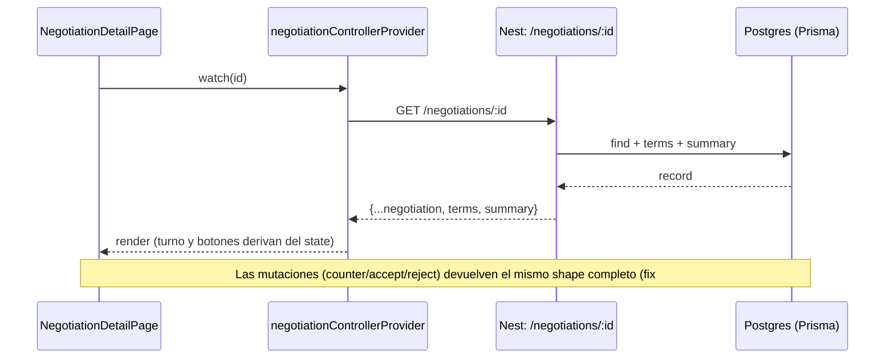

# Mapa de rutas de la app (referencia)

Rutas registradas en `apps/mobile/lib/config/app_router.dart`
(`goRouterProvider`, Riverpod + go_router). Estado: fix QA #46.

## Tabla de rutas

| Ruta | Nombre | Pantalla | Parámetros | Estado |
|---|---|---|---|---|
| `/` | `home` | `PropertyDetailPage` (placeholder E2E) | — | Temporal hasta HAB-15 |
| `/negociacion` | `negociacion` | `NegotiationDetailPage` (HAB-27) | `?id=` opcional | Sin `id`: demo Stitch local; con `id`: backend HAB-26 |
| `/firma-digital` | — | No registrada | — | **Rota**: dos botones la invocan (`PropertyDetailPage`, `NegotiationDetailPage`), la página no existe (HAB-27 pendiente) |

## Diagrama de navegación

```mermaid
flowchart TD
    APP["HabitaNexusApp\n(MaterialApp.router)"] --> ROUTER["goRouterProvider\ninitialLocation: /negociacion"]
    ROUTER --> HOME["/ — home\nPropertyDetailPage\n(placeholder E2E)"]
    ROUTER --> NEG["/negociacion — negociacion\nNegotiationDetailPage"]
    NEG --> DEMO["sin ?id=: demo Stitch local"]
    NEG --> API["con ?id=: GET /negotiations/:id\n(backend HAB-26)"]
    HOME -.->|"/firma-digital (no registrada)"| BROKEN(["DigitalSignaturePage\nNO EXISTE — HAB-27")]
    NEG -.->|"/firma-digital (no registrada)"| BROKEN
```

## Flujo `/negociacion?id=` (HAB-26 ↔ HAB-27)


