# SOP — Escrow del depósito de garantía

**Fecha**: 2026-04-15
**Versión**: 1.0 (draft)
**Audiencia**: stakeholders de negocio, equipo legal (Sfera Legal), ingeniería, producto.
**Propósito**: documentar cómo HabitaNexus retiene el depósito de garantía de alquiler sin tocar fondos fiat, usando Trustless Work + USDC on-chain en Stellar.

---

## Contexto regulatorio

HabitaNexus **no tiene licencia SUGEF**. Por ende **no toca fondos en colones en ningún momento**. Operar como intermediario de fondos fiat sin licencia = operador financiero no autorizado = expuesto a sanción y cierre.

La propuesta de valor se sostiene separando en **dos carriles regulatoriamente independientes**:

| Flujo | Monto | Medio | ¿Custodia / procesa? | ¿HabitaNexus toca fondos? |
|---|---|---|---|---|
| **Depósito de garantía** | Una vez (al firmar) | USDC on-chain | Smart contract Soroban (Trustless Work) | **No** (el código custodia, no una persona) |
| **Pagos mensuales de alquiler** | Recurrente | SINPE colones | **Kindo** (procesador regulado CR) | **No** (flujo directo inquilino → propietario) |

HabitaNexus es **plataforma de coordinación**, nunca payee ni custodio. Las partes (inquilino y propietario) mantienen la custodia de sus propios fondos en todo momento.

---

## Flujo end-to-end

```mermaid
flowchart TD
    A[Inquilino y propietario<br/>negocian en HabitaNexus] --> B[Expediente digital creado<br/>con términos acordados]
    B --> C{Firma del contrato}

    C --> D[Inquilino abre WebView<br/>Onramper embebido]
    D --> E[Inquilino paga colones<br/>por tarjeta, ACH, etc.]
    E --> F[On-ramp convierte<br/>colones → USDC]
    F --> G[USDC llega a wallet<br/>Stellar del inquilino<br/>custodia en flutter_secure_storage]

    G --> H[SDK Dart: initializeEscrow<br/>TW gateway devuelve unsigned XDR]
    H --> I[KeyPair del platform signer<br/>firma vía TransactionSigner]
    I --> J[sendTransaction helper<br/>contrato Soroban desplegado]

    J --> K[SDK Dart: fundEscrow<br/>TW devuelve unsigned XDR]
    K --> L[KeyPair del inquilino firma<br/>transferencia USDC]
    L --> M[🔒 USDC retenido on-chain<br/>en contrato Soroban]

    M --> N[Contrato de alquiler vigente]
    N --> O[Mes N: inquilino paga alquiler<br/>vía Kindo SINPE]
    O --> P[Kindo procesa colones<br/>inquilino → propietario DIRECTO<br/>HabitaNexus NO toca fondos]
    P --> Q[Webhook Kindo al backend HabitaNexus<br/>expediente digital actualizado]
    Q --> R{¿Último mes?}
    R -->|No| O
    R -->|Sí| S[Fin del contrato<br/>inspección del inmueble]

    S --> T{Estado del inmueble}
    T -->|OK| U[SDK Dart: releaseFunds<br/>approver firma]
    T -->|Daños| V[SDK Dart v0.2: startDispute]
    V --> W[Dispute resolver decide<br/>porcentajes de reparto]
    W --> X[SDK Dart v0.2: resolveDispute]

    U --> Y[USDC del escrow<br/>→ wallet inquilino]
    X --> Z[USDC repartido:<br/>% inquilino + % propietario]

    Y --> AA[Opcional: off-ramp<br/>USDC → colones vía WebView]
    Z --> AA

    classDef fiat fill:#fef3c7,stroke:#d97706
    classDef crypto fill:#dcfce7,stroke:#16a34a

    class D,E,F,O,P,Q,AA fiat
    class H,I,J,K,L,M,U,V,W,X,Y,Z crypto
```

**Leyenda del diagrama**

- 🟨 **Amarillo (fiat)**: el dinero está en colones. Procesado por provider regulado (Onramper o Kindo). HabitaNexus no lo toca.
- 🟩 **Verde (crypto)**: el dinero está en USDC on-chain en Stellar/Soroban. Custodiado por smart contract. HabitaNexus coordina, no custodia.

---

## Quién toca qué

| Actor | Rol en el flujo | ¿Custodia fondos? |
|---|---|---|
| **Inquilino** | Paga on-ramp, firma `fundEscrow` con su wallet embebida, recibe USDC al final del contrato | Sí (su propia wallet, vía `flutter_secure_storage`) |
| **Propietario** | Recibe pagos mensuales SINPE en su cuenta bancaria CR, aprueba `releaseFunds` al terminar | Sí (su propia wallet + su cuenta bancaria) |
| **HabitaNexus** | Plataforma de coordinación: negociación, expediente digital, invocación del SDK Dart, recepción de webhooks Kindo | **No** (nunca) |
| **Trustless Work** | Opera API gateway (`api.trustlesswork.com`) + smart contracts Soroban | No (el código custodia, no TW) |
| **Onramper (o equivalente)** | Procesa conversión colones → USDC (on-ramp) | Temporalmente, durante la conversión |
| **Kindo** | Procesa transferencias SINPE mensuales (fiat CR) | Temporalmente, durante cada transferencia |

---

## Puntos críticos de cumplimiento

1. **HabitaNexus nunca recibe colones en cuenta propia**. Todos los flujos fiat (on-ramp, pagos mensuales) van directo entre user y provider regulado. Sin esto, HabitaNexus se convierte en operador financiero no autorizado.

2. **La wallet del usuario es custodia propia, no custodia de HabitaNexus**. La private key vive en `flutter_secure_storage` del dispositivo del usuario. HabitaNexus no puede acceder a ella. En caso de pérdida del dispositivo sin recovery, los fondos on-chain quedan inaccesibles — parte de la responsabilidad del usuario se absorbe por el diseño de recovery (pendiente de definir: seed phrase backup, social recovery, etc.).

3. **El contrato Soroban es auditable y no-custodial**. Cualquier parte puede verificar on-chain que el escrow existe, contiene X USDC, y tiene las condiciones Y. HabitaNexus no puede mover fondos arbitrariamente.

4. **Resolución de disputas es adjudicación, no custodia**. El rol `disputeResolver` del contrato (que puede ser un panel de árbitros de HabitaNexus o un tercero) decide porcentajes pero no recibe los fondos a su cuenta — los fondos se reparten automáticamente por el contrato.

---

## Dependencias externas (fuera del alcance del SOP del SDK)

- **On-ramp provider**: Onramper (candidato principal), validar soporte USDC-Stellar + SINPE Móvil via API real. Spike separado.
- **Kindo**: integración B2B bajo contrato con Prosoft CR. Vive en backend NestJS. Spike separado.
- **Fee sponsorship en Stellar**: preguntar a Trustless Work cómo manejan XLM fees (¿platform absorbe vía `FeeBumpTransaction`?).

---

## Referencias

- [`flujo-arrendamiento.md`](./flujo-arrendamiento.md) — flujo general del arrendamiento, del cual este SOP profundiza la etapa de escrow.
- [`trustless-work-dart-spike-design.md`](../planes/trustless-work-dart-spike-design.md) — spec técnica del SDK Dart.
- `packages/trustless_work_dart/README.md` — doc del paquete (pendiente de crear).
- `packages/trustless_work_flutter_storage/README.md` — doc del hermano (pendiente).
- `~/Escritorio/lapc506-personal-dogfood/structure-decision.md` — contexto de urgencia legal (Delaware LLC + CR SRL).
- [Trustless Work docs](https://docs.trustlesswork.com/trustless-work) — referencia API oficial.
